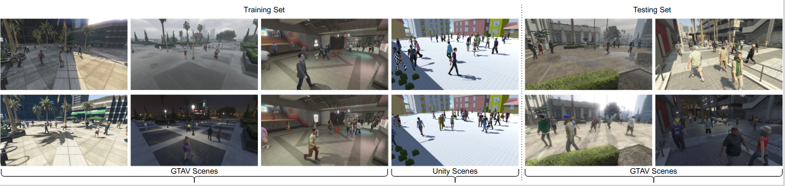

# GMVD Dataset [[WACV](https://openaccess.thecvf.com/content/WACV2023W/RWS/html/Vora_Bringing_Generalization_to_Deep_Multi-View_Pedestrian_Detection_WACVW_2023_paper.html)][[arXiv](https://arxiv.org/abs/2109.12227)]
The GMVD dataset contributes to generalized multi-view detection with overlapping field-of-view. We build a synthetic dataset for multi-view detection using Grand theft Auto V (GTAV) and Unity Game Engine. The GMVD dataset includes seven distinct scenes, one indoor (subway) and six outdoors. One of the scenes are reserved for the test split. We vary the number of total cameras in each scene and provide different camera configurations within a scene. Additional salient features of GMVD include daytime variations (morning, afternoon, evening, night) and weather variations (sunny, cloudy, rainy, snowy). The images in the dataset are of high resolution, 1920x1080, and are synchronized. Average coverage varies from 2.76-6.4 cameras depending on the scene.


|Dataset | IDs | # Scenes | # Training Frames | # Testing Frames | # Cameras  | # Sequences |  Avg. Coverage | Resolution
|-------------| ------------- | ------------- | ------------- | ------------- | -------------  | ------------- |  ------------- |------------- |
|WildTrack | 313 | 1 | 360 | 40 | 7 | 1 | 3.74 | 1920X1080 |
|MultiViewX |350 | 1 | 360 | 40 | 6 | 1 | 4.41 | 1920X1080 |
|GMVD (Ours) | 2800 | 7 | 4983 | 1012 | 3, 5, 6, 7, 8 | 53 | 2.76 - 6.4 | 1920X1080 |

## Download
* Please download the dataset from this [link](https://iiitaphyd-my.sharepoint.com/:u:/g/personal/jeet_vora_alumni_iiit_ac_in/EZ80z5WOyvxKiPH4dU65Wn4BYzET0QwHSMywJWu_VXAzKw) (~50GB).
* Run vid2frame.py to extract frames
```[GMVD/GMVD_DATA]$ python vid2frame.py```

### Folder structure
```
GMVD_DATA
├── vid2frame.py
├── DATASETS
│   ├── scene1
│   ├── *
│   └── scene6
└── detect
    ├── gta_scene5
    │   ├── annotations_positions
    │   │   ├── 00000.json
    │   │   ├── 00001.json
    │   │   └── *
    │   ├── calibrations
    │   │   ├── extrinsic
    │   │   │   ├── extr_Camera1.xml
    │   │   │   ├── extr_Camera2.xml
    │   │       └── *	
    │   │   └── intrinsic
    │   │       ├── intr_Camera1.xml
    │   │       ├── intr_Camera2.xml
    │   │       └── *
    │   ├── config.json
    │   ├── gt.txt
    │   ├── Image_subsets
    │   │   ├── C1
    │   │   ├── C2
    │   │   └── *
    │   ├── matchings
    │   │   ├── Camera1_3d.txt
    │   │   ├── Camera1.txt
    │   │   ├── Camera2_3d.txt
    │   │   ├── Camera2.txt
    │   │   └── *
    │   └── rectangles.pom
    ├── unity_scene1
    └── unity_scene2
 ```
 
## Dataset Configurations
Each and every scene in dataset has its own configurations, specified in ```config.json``` file.
```
example :-
{ 
  "Dataset": "gta_scene1_A", 
  "num_cam": 6, 
  "num_frames": 323, 
  "img_shape": [1080, 1920], 
  "grid_shape": [800, 1200], 
  "grid_cell": 0.025, 
  "origin": [0,0], 
  "region_size":[20,30]
}

```

## Experimental Setup
* Clone this repository
* Follow this [link](https://github.com/jeetv/GMVD) to setup the environment.
* 2 Nvidia GTX 1080 Ti GPU's are been used for training with GMVD dataset.

## Training
```
[GMVD]$ python main.py -d gmvd_train -b 1 -pr --avgpool --cls_thres 0.2
```
## Inference
* Note : --cls_thres is the parameter need to be tuned to get appropriate results.
* Download the pretrained weights from this [link](https://iiitaphyd-my.sharepoint.com/:f:/g/personal/jeet_vora_research_iiit_ac_in/EoZySkQaB2NAuBqbyGwwwX0BP4Ma33QIWdMvlJrczeQoHQ?e=2Z7xgT)
* Inference on Wildtrack dataset
```
[GMVD]$ python main.py -d wildtrack --avgpool --resume trained_models/gmvd/Multiview_Detection_gmvd.pth --cls_thres 0.24
```
* Inference on GMVD test set
```
[GMVD]$ python main.py -d gmvd_test --avgpool --resume trained_models/gmvd/Multiview_Detection_gmvd.pth --cls_thres 0.17
```
## License and Important Note
* This dataset is for educational and non-commercial research purpose only. GMVD Dataset is licensed under a [](https://creativecommons.org/licenses/by-nc/4.0/)

* As a courtesy towards Take-Two Interactive and Rockstar Games, please purchase Grand Theft Auto V, if you use the data.

## Citation
```
@InProceedings{Vora_2023_WACV,
    author    = {Vora, Jeet and Dutta, Swetanjal and Jain, Kanishk and Karthik, Shyamgopal and Gandhi, Vineet},
    title     = {Bringing Generalization to Deep Multi-View Pedestrian Detection},
    booktitle = {Proceedings of the IEEE/CVF Winter Conference on Applications of Computer Vision (WACV) Workshops},
    month     = {January},
    year      = {2023},
    pages     = {110-119}
}

```
